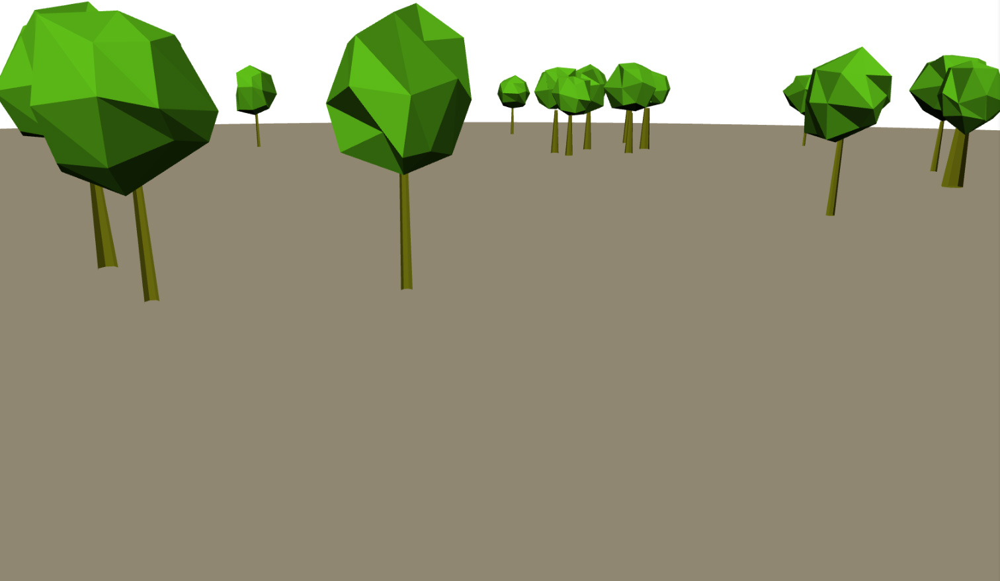

ds.babylonHxEx10
(DemoScene).babylonHxEx10
=============
<pre>
 ____  __  ____ _  _ __    __  __ _ ____ _  _ __  __  
(  _ \/ _\(  _ ( \/ |  )  /  \(  ( (  __| \/ )  \/  \ 
 ) _ (    \) _ ()  // (_/(  O )    /) _) )  (_/ (  0 )
(____|_/\_(____(__/ \____/\__/\_)__|____|_/\_|__)\__/ 

</pre>

WIP Visual errors

Currently this scene has light issues and intensity issues. Native builds are not working on this example investigate percision error for native clients.

http://www.pixelcodr.com/tutos/trees/trees.html

